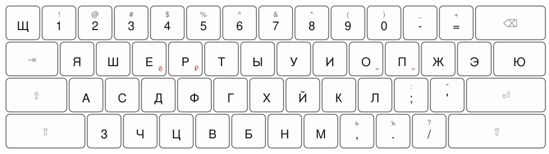

# Yasherty

A custom Russian keyboard layout: Russian letters rearranged so that the top row starts with **я ш е р т ы** — hence the name, by analogy with QWERTY.

Grey characters are typed with Shift, red ones with Option.

## Why

> Why waste time learn lot layout when few layout do trick.

Yasherty is phonetic: every Russian letter sits on the Latin key that sounds like it (р on R, к on K, …). Learn QWERTY for a regular keyboard — or whatever layout your keyboard uses — and you can type both English and Russian; ЙЦУКЕН never has to enter your head. Apple ships a similar phonetic Russian layout, but I find this arrangement more logical.

## What makes it different from standard Russian (ЙЦУКЕН)

- Letters are rearranged (see the picture above); `щ` lives on the backquote key.
- Punctuation stays where it is in the US layout: `;` `:` `'` `"` `,` `.` `/` `?` and the digit-row symbols `!@#$%^&*()`.
- `ь` is typed with Shift+`,` and `ъ` with Shift+`.`.
- `ё`, `₽`, `«`, `»` are on Option: `ё` on `е`, `₽` on `р`, `«`/`»` on `о`/`п`.

## Installation (macOS)

Copy `Yasherty.bundle` to `~/Library/Keyboard Layouts/`, log out and back in, then add **Yasherty** in System Settings → Keyboard → Input Sources (it is listed under Russian).

The bundle was made with [Ukelele](https://software.sil.org/ukelele/).

## See also

I use this layout alongside [APToshka](https://github.com/didedoshka/APToshka), my 36-key keymap.
